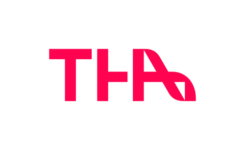

import { Card, CardGrid } from '@astrojs/starlight/components';

<CardGrid stagger>
	<Card title="Team Mitglieder" icon="pencil">
		- Johannes
	</Card>
	<Card title="Administratoren" icon="setting">
		- ...
	</Card>
	<Card title="Software" icon="open-book">
		- [Zappier]()
		- [Formstack]()
		- [Pushover]()
		- [Doku](https://starlight.astro.build/)
	</Card>
	<Card title="Im Auftrag" icon="external">
		
	</Card>
</CardGrid>
